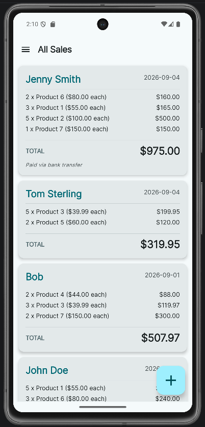
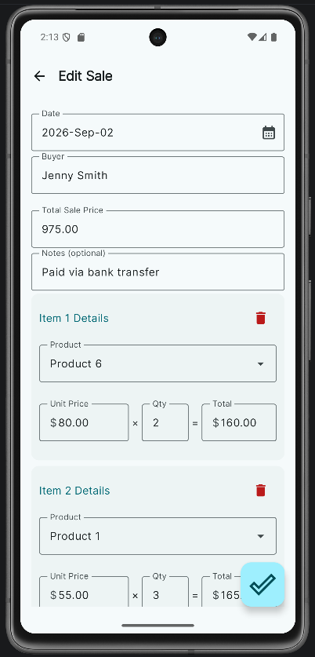
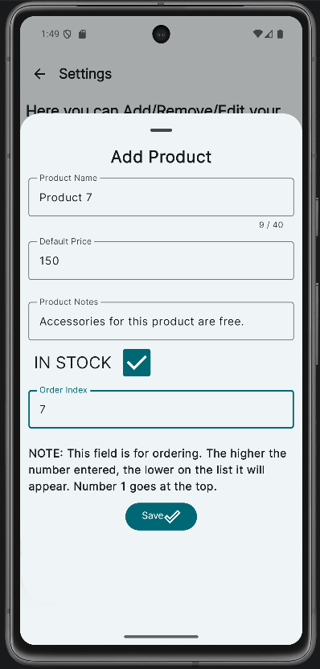
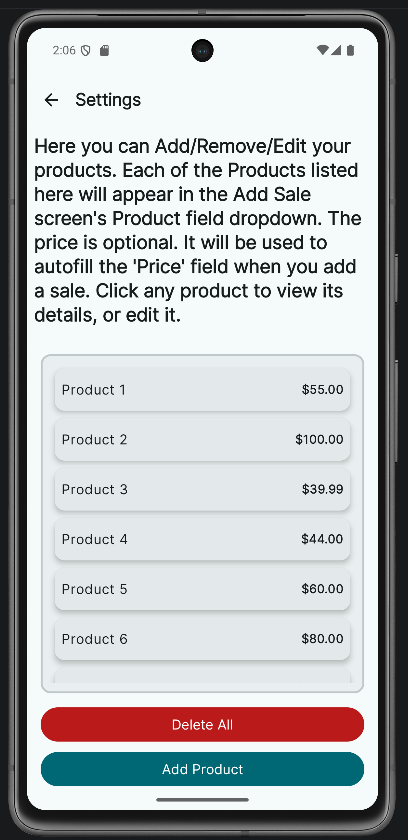

# Swift Sales

**Swift Sales** is a modern, offline-first Android application designed to help independent sellers and small businesses transition from paper-based sales records to a streamlined digital workflow.

Built with **Kotlin, Jetpack Compose, and Material 3**, Swift Sales provides a clean interface for managing products and tracking sales while keeping data available locally without requiring an internet connection.

## 📱 Screenshots

### Sales Overview



### Add / Edit Sale



### Product Details



### Product Management



## 🚀 Features

* **Product Management**
  Manage your product catalog with custom pricing, stock status, and ordering.

* **Dynamic Sale Tracking**
  Create sales containing multiple items, with automatic price fetching and support for individual item quantities.

* **Data Integrity**
  Products that appear in existing sales can’t be deleted, so historical records stay intact.

* **Batch Operations**
  Select multiple sales and delete them in a single operation.

* **Offline-First**
  All application data is stored locally using Room, allowing the application to function without an internet connection.

* **Responsive UI**
  Built with Jetpack Compose and Material 3 for a modern Android user experience.

## 🛠️ Tech Stack

* **Language:** Kotlin
* **UI:** Jetpack Compose with Material 3
* **Architecture:** MVVM with MVI-style unidirectional state management
* **Dependency Injection:** Hilt
* **Database:** Room (SQLite)
* **Database Integrity:** Foreign key constraints and automated migrations
* **Asynchrony:** Kotlin Coroutines and Flow
* **Navigation:** Navigation Compose

## 📖 Usage

### 1. Define Your Catalog

Navigate to:

**Menu → Settings → Add Product**

Create the products that will be available when recording sales. Product information and pricing are automatically used when adding items to a sale.

### 2. Record a Sale

Tap the **"+"** button in the bottom-right corner.

Enter the sale date and buyer information, then add as many products and quantities as needed. Tap the checkmark to save the sale.

### 3. Manage Sales

* **Edit:** Select an existing sale to modify its details or items.
* **Delete:** Long-press sales to enter selection mode, select multiple records, and use the trash icon to delete them.

### 4. Manage Products

Products can be added, edited, or removed through **Settings**.

If a product is referenced by an existing sale, the application prevents its deletion to preserve historical sales data.

## 🏗️ Project Structure

The project follows a layered architecture with a focus on separation of concerns and maintainability.

```text
data/
├── entities/
├── dao/
└── repositories/

ui/
├── screens/
├── components/
└── theme/

viewModel/

utils/
```

The exact structure may evolve as the project develops.

## 💾 Offline-First Design

Swift Sales is designed to work without requiring an internet connection.

Application data is stored locally using Room over SQLite, allowing information to be accessed immediately and ensuring that the core functionality remains available even when connectivity is unavailable.

## 🔒 Data Integrity

The database uses foreign key relationships to maintain consistency between products and sales.

For example, a product that is referenced by an existing sale cannot simply be deleted. This helps preserve the historical information associated with previous transactions.

Database changes are managed through Room migrations to allow the database schema to evolve without unnecessarily losing existing data.

## 🎯 Project Goals

Swift Sales was created with a few simple goals:

* Make sales tracking easier than maintaining paper records.
* Keep frequently used information immediately accessible.
* Provide a straightforward and pleasant user experience.
* Keep the application functional without an internet connection.
* Maintain reliable relationships between products and sales.
* Build the application using modern Android development practices.

## 📌 Project Status

Swift Sales is an open-source project under active development.

Focus is on keeping the experience useful and straightforward. More features may come as the project evolves!

## 📄 License

This project is licensed under the MIT License.
